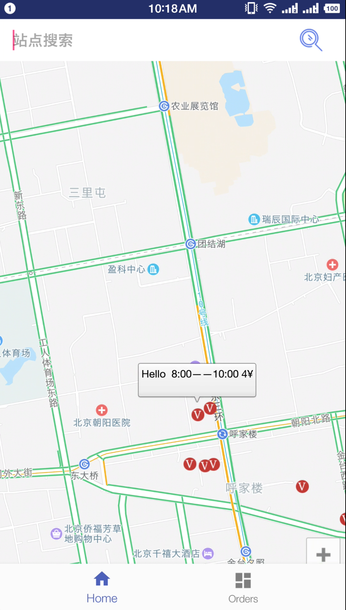
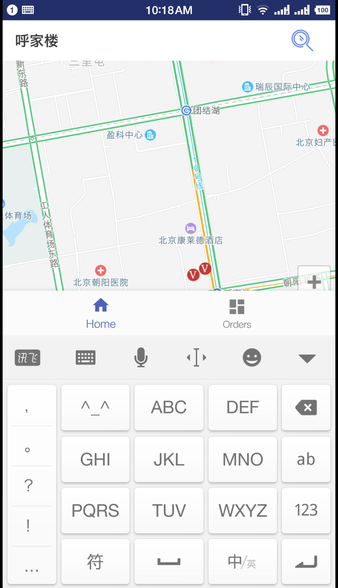
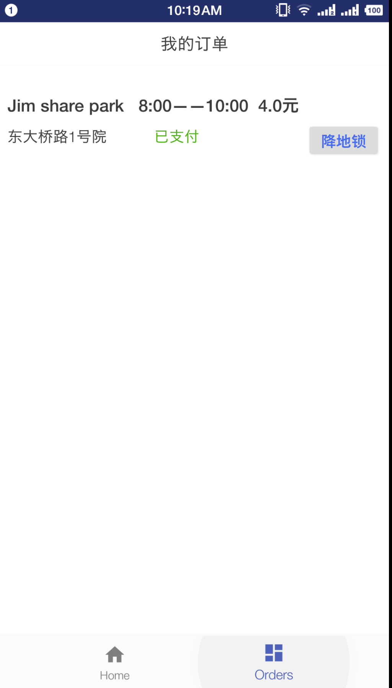
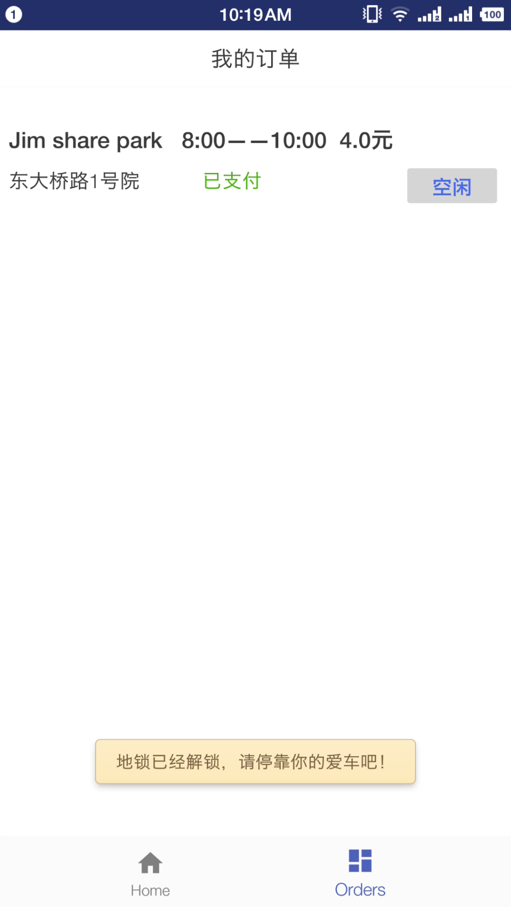

# ParkingChain（Pi）

This is a blockchain-based shared parking lot solution. 

## 0x00 Problem

According to the survey, the supply and demand of domestic parking spaces is seriously imbalances. In small and medium-sized cities, two cars are fighting for one parking space. 

* Parking difficultly, there is not enough parking for working days, low utilize of parking space and the parking ratio is unreasonable. 

* Manage problems:parking violations are serious which brings difficulties to traffic management. 

* Charges are opaque: the parking systems are not unified between different parking spaces, so charge standards can’t transparent. 

  

## 0x01 Solutions 

The main solution of  our team is to apply the  technology of the internet of things and blockchain to sharing parking.

* When entering a property, you need to install an intelligent license plate recognition system and import and export barrier gates so that unattended vehicles can enter and exit. IoT devices are also required to upload parking space data and user payment information to the blockchain. Software and hardware are coordinated throughout the entire business chain. 
* Consumer experience.Using smart parking lock to lock unopened parking spaces, and use the smart operation of the smart lock on the APP to achieve stop-and-use, lock-away. 
* Blockchain technology, which records the information of each participant and the records of each order settlement, truly “check it out, make reservations”, and support audit historical transaction records. 

## 0x02 Screenshot

Available parking lot:

Searching parkint lot based on address:

Ordering parkint lot:

Ordered parking lot:

Using parking lot:

## 0x03 Future

As for now, the code implemented is just for poc, we are planning to do lots of work.

* Business expansion. Layout of medium and large-scale commercial complexes, office buildings, high-end and middle-end communities, large-scale public transportation hubs, and airports in first-tier cities. 
* Strategic cooperation. Through cooperation with community properties and commercial real estate, speed up the deployment of market share and become a domestic unicorn. 
* The blockchain platform points platforms to provide a rich business ecosystem. All types of participants can obtain different commercial interests according to their own resources and provide free and open access methods. Any institution or individual that has passed the registration review can freedom to issue their own points, merchants can also free shelves of goods and services, the use of mutual evaluation to build a credit system, survival of the fittest. 